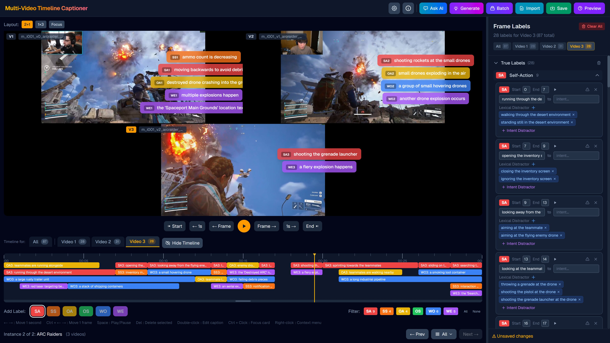
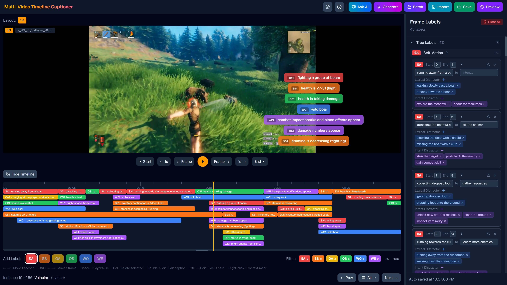

# GameplayQA Multi-Video Timeline Captioner


[](https://sync-video-label.vercel.app)
[](https://hats-ict.github.io/gameplayqa/)
[](https://arxiv.org/abs/2603.24329)
[](https://www.youtube.com/watch?v=PKedELJ4XT0)

This tool supports the paper:  
**[GameplayQA: A Benchmarking Framework for Decision-Dense POV-Synced Multi-Video Understanding of 3D Virtual Agents](https://arxiv.org/abs/2603.24329)** For more details, visit the [project website](https://hats-ict.github.io/gameplayqa/).

<div align="center">
  
  
</div>

<div align="left">
  </br>
  <a href="https://www.youtube.com/watch?v=PKedELJ4XT0">
    
  </a>
</div>

## Live Demo

A live demo is hosted here: **[https://sync-video-label.vercel.app](https://sync-video-label.vercel.app)**

Click the **"Load Example Project"** button on the landing page to explore the app with a pre-loaded dataset.

> Note: The demo is read-only. Saving annotations and exporting files requires running the app locally. Video files are purposely made low quality to reduce file size.

## Quick Start

### 1. Install and run

```bash
npm install
npm run dev
```

Open [http://localhost:3000](http://localhost:3000) in your browser.

### 2. Try the example project

The example project is included in this repo. Check out `data/project-example/videos/` for sample videos and `data/project-example/project_example.json` as a reference for the project file format.

You can also directly see it in the Live Demo link above.

### 3. Import your own data

1. Prepare your video files and a `project.json` following the formats described in [Data Folder Structure](#data-folder-structure) and [Project File Format](#project-file-format). Only the project folder, video files, and the JSON file are required — all other folders are created automatically.
2. Rename `.env.local.example` to `.env.local` and fill in your API keys for [OpenRouter](https://openrouter.ai/) or [Google AI Studio](https://aistudio.google.com/):

```env
OPENROUTER_API_KEY=
GOOGLE_API_KEY=
```

3. Import your `project.json` in the app. You should be able to see the videos. Click the **"Generate"** button to test AI functionalities.

## Data Folder Structure

Organize your data into project folders:

```
data/
├── project-a/                    # Project folder
│   ├── videos/                   # Video files
│   │   ├── video1.mp4
│   │   └── video2.mp4
│   ├── annotation/               # Saved annotations (output)
│   │   └── instance-001.json
│   ├── autosave/                 # Auto-saved annotation progress
│   │   └── instance-001.json
│   ├── prediction/               # Pre-generated labels (optional)
│   │   └── instance-001.json
│   ├── questions/                # Exported questions from question editor
│   │   └── instance-001-2025-01-01T00-00-00.json
│   ├── autosave_question/        # Auto-saved question editor progress
│   │   └── instance-001.json
│   └── project.json              # Project configuration file
├── project-b/                    # Another project
│   └── ...
```

## Project File Format

Create a JSON file to define your labeling project:

```json
{
  "name": "My Project",
  "instances": [
    {
      "id": "instance-001",
      "name": "Scene 1",
      "videos": ["data/project-a/videos/video1.mp4", "data/project-a/videos/video2.mp4"],
      "prediction": "instance-001.json"
    }
  ]
}
```

| Field        | Description                                                            |
| ------------ | ---------------------------------------------------------------------- |
| `id`         | Unique identifier for the instance                                     |
| `name`       | Display name                                                           |
| `videos`     | Array of video paths (relative to project root)                        |
| `prediction` | Optional prediction file to auto-load (relative to `data/prediction/`) |

## Usage

1. Create a project folder in `data/` (e.g., `data/my-project/`)
2. Place your videos in `videos/` subfolder
3. Create a `project.json` file defining your instances
4. Click the empty area to import your project file
5. Drag on the timeline to create labels
6. Double-click labels to add captions
7. Click "Save Annotation" to export
